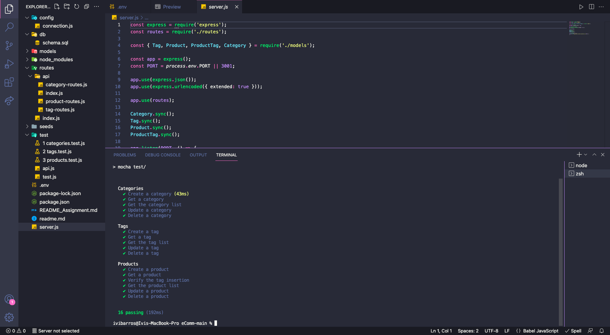
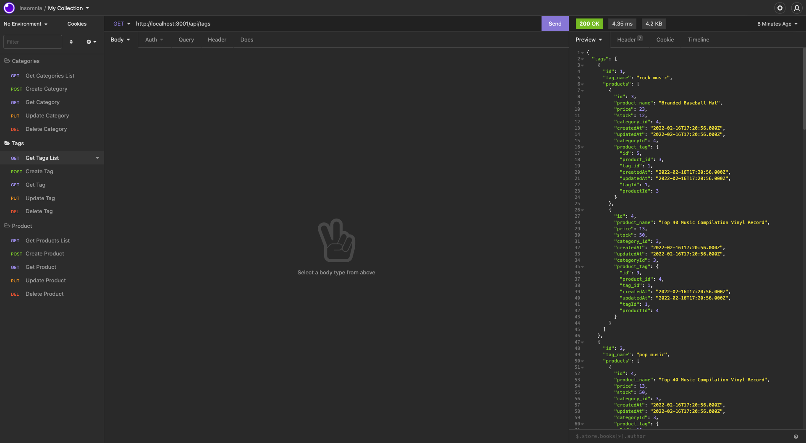
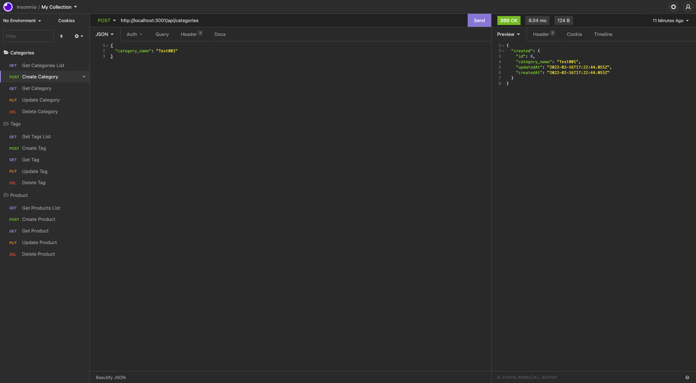
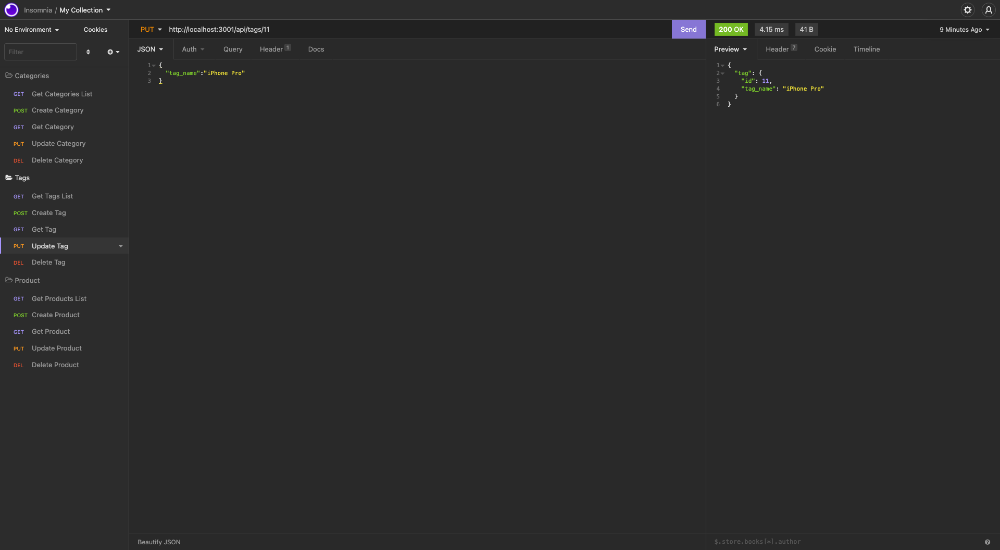
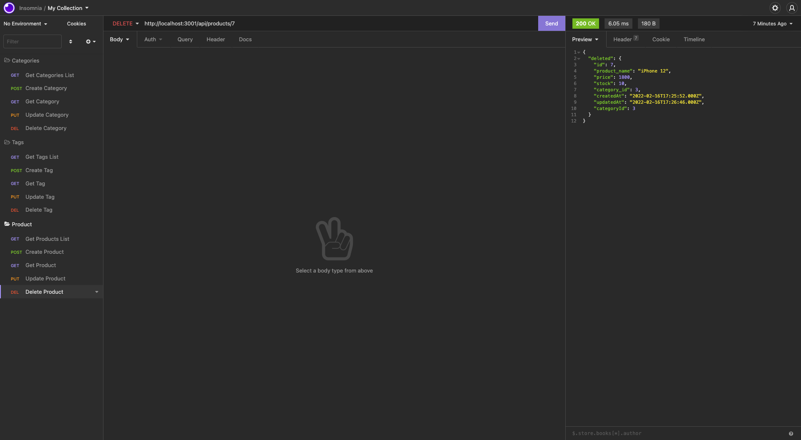

# eCommerce Back End

## License

  
   
  
  
## Technologies
      
   
  
  
  <h2>Table of Contents</h2>
  
  * [Technologies](#tech)
  * [Description](#description)
  * [Usage](#usage)
  * [Screenshots](#scrs)
  * [Link to the live view](#live)
  * [Questions](#questions)

## Description
[Main Menu](#home)

My task in this assignment was to build the back end for an e-commerce site. 
This application offers the ability to create, read, update and delete products, tags and categories form the store database.

## Usage

[Main Menu](#home)
  
-Create the ecommerce_db schema using workbench (or your preferred method to perform this action); 
-Use the command line: "npm run seeds"; 
-To run the application, please run the command line: "npm install" or "npm i" followed by the command "npm start" 
-To run the built-in automated test using node.js, please use the command line: "npm run test". Note that this command needs to be executed in a second terminal, after starting the server using "npm start". 

 

## Screenshots 
<table>
<tr>
<td></td>
<tr>
<td></td>
<tr>
<td></td>
</tr>
<tr>
<td></td>
<tr>
<td></td>
</tr>
</table>
 

## Live view
[Main Menu](#home)

GitHub Repository-> <a href="https://github.com/ibarros19/eComm" target="_blank">LINK</a> 
 
Video Demo-> <a href="https://youtu.be/t01BqRAGf8w" target="_blank">LINK</a> 

## Questions
[Main Menu](#home)

If you have any further questions, please feel free to contact me on GitHub at [ivibarros19](https://github.com/ivibarros19) or by email at [ivibarros19@gmail.com](ivibarros19@gmail.com).
